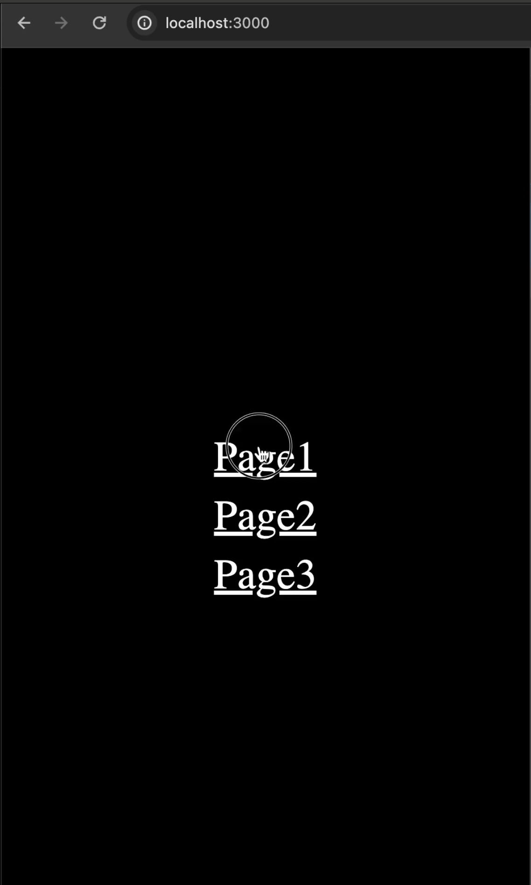

# Bug: Flashing UI when multiply redirects

## Description
When sequentially redirecting between several pages, the interface blinks. It looks like the loading component has already been removed and the new one has not yet been loaded.

## Implementation
```bash
npm i
npm run build && npm run start
```

## Live Example
[](./media/nextjs-redirect-loading-bug.mp4)
